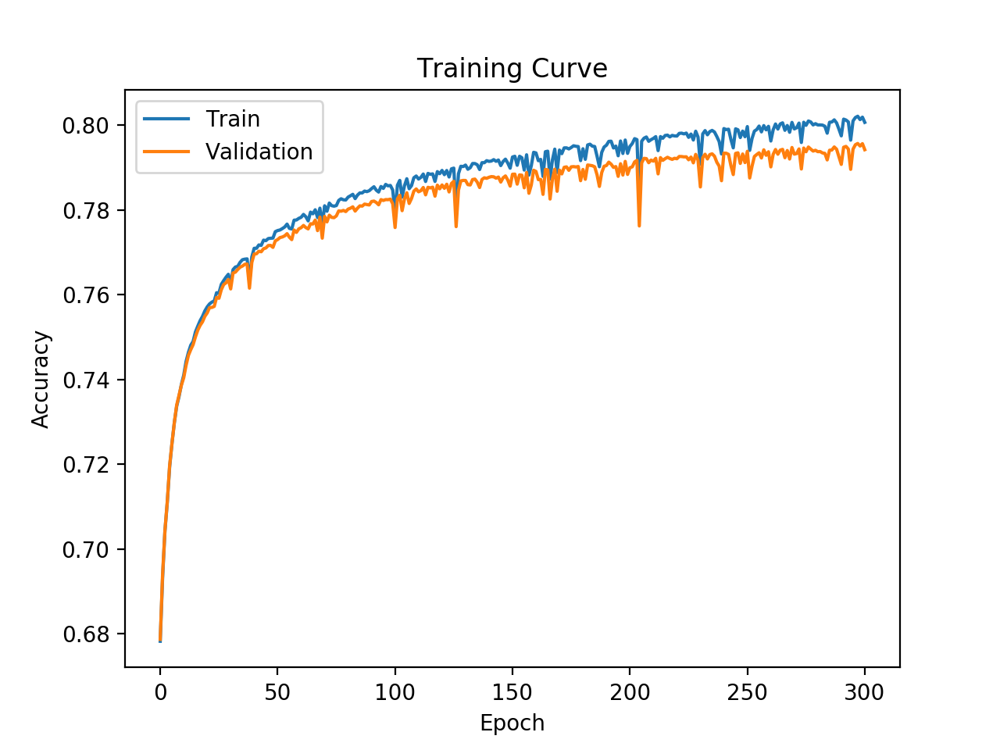

# Sentiment Analysis using LSTM model
<div style="padding-left:10px; padding-right:15px;">An LSTM model for sentiment analysis and API provided for those who want to use LSTM sentiment analysis for their applications.</div>
<hr>

### Table of Contents
1. [Overview](#Overview)
3. [Model Training](#model-training)
3. [File Descriptions](#file-descriptions)
2. [Sentiment Analysis API](#sentiment-analysis-aPI)

 
### Overview:
<div style="padding-left:10px; padding-right:15px;"> This is an LSTM model that allows users to do fundamental sentiment analysis. 

- Provides the users the ability to prepare data for the ML model
- It provides users the ability to create complex mini-batches of large data.
- Allows users to train model, plot graphs and saves checkpoint for early stopping.</div>

### Model Training:
<div style="padding-left:10px; padding-right:15px;">
The LSTM model is trained on the dataset provided by <a href="http://help.sentiment140.com/for-students">sentiment140</a>. The dataset was divided as follows:

- Training set : 954177 tweets (~60%)
- Validation set : 317964 tweets (~20%)
- Testing set : 318072 tweets (~20%)

The data provided where tweets that are considered to have positive sentiment or a negative sentiment. The model was trained on 300 epochs with batches of 128 and a learning rate of 2e-5. The training is shown in the graph below:



As we can observe, there is a slight overfit after epoch ~50. The maximum training accuracy the model reached is ~80%. Even with 80% accuracy, the model is showing promising results with sentiment analysis.

</div>

### File Descriptions:
<div style="padding-left:10px; padding-right:15px;">
The whole project is divided into 5 different files for ease of readability and modifications. 

- `model.py`: The main file that contains the LSTM model.
- `prepare.py`: This files reads the data from the file specified, divides the files into datasets and prepare them to be used by the model.
- `batching.py`: This files creates batches of the dataset during the training process.
- `train.py`: This files contains functions that trains the model, finds it's accuracy and save checkpoints for early stopping purposes.
- `loader.py`: This file is used to load a checkpoint, and find sentiment on a piece of text.


</div>

### Sentiment Analysis API:
<div style="padding-left:10px; padding-right:15px;"> You can access the REST API created using the LSTM model in this repo. The location for REST API server is:

`www.sentiment-analysis-api.site`

The REST API sends 2 responses to a request made:

- 0 : If the sentiment of a sentence is _negative_
- 1 : If sentiment of a sentence is _positive_

You can access the API as follows:

__Single Sentence:__

<div style="padding-left:10px; padding-right:15px;"> 

If you want to parse a single sentence, to determine it's sentiment, we can send a basic JSON object using curl as follows:

```sh
>> curl -d '{"data":"this is awesome"}' -H "Content-Type: application/json" -X POST https://www.sentiment-analysis-api.site/api/one
1

>> curl -d '{"data":"I need a hug"}' -H "Content-Type: application/json" -X POST https://www.sentiment-analysis-api.site/api/one
0

>> curl -d '{"data":"i wish i was happy"}' -H "Content-Type: application/json" -X POST https://www.sentiment-analysis-api.site/api/one
0
```

</div>

__Bulk Sentences__

<div style="padding-left:10px; padding-right:15px;"> 

If you want to parse bulk of sentences in order to determine it's sentiment, you can send a basic JSON object using curl as follows:


```sh
>> curl -d '{"data":["This is awesome", "I need a hug", "i wish i was happy","My name is Beant"]}' -H "Content-Type: application/json" -X POST https://www.sentiment-analysis-api.site/api/bulk
{
  "I need a hug": 0, 
  "My name is Beant": 1, 
  "This is awesome": 1, 
  "avg": 0.5, 
  "i wish i was happy": 0
}
```
where `avg` is average score of the sentences.

</div>
</div>


